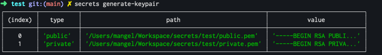
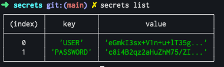
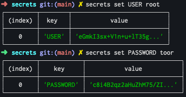
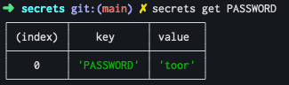

# :speak_no_evil: secrets-js

Simple CLI tool to handle encrypted secrets, heavily inspired in [Symfony Secrets](https://symfony.com/doc/current/configuration/secrets.html).

With `undisclosed` you can set and store your credentials encrypted, and dump it in plain whenever you want.

## generate-keypair
With `undisclosed generate-keypair` you will generate your keypair. It will be used to encrypt all your data.

**:warning: CAUTION:** Never commit your private key files to a version control system.

## list
With `undisclosed list` you can list the secrets you previously stored.

## set
With `undisclosed set KEY value` you can store a new secret.

## get
With `undisclosed get KEY` you can retrieve a secret value.

## dump
With `undisclosed dump` you can dump all the stored secrets decrypted into a `.env` file.
